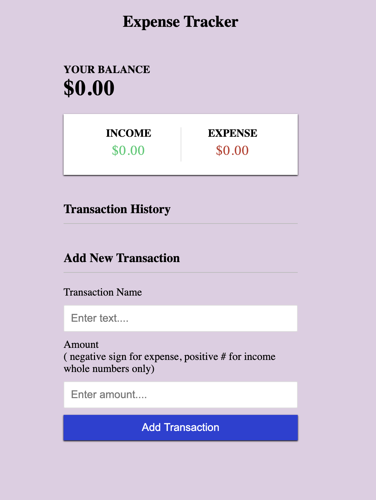
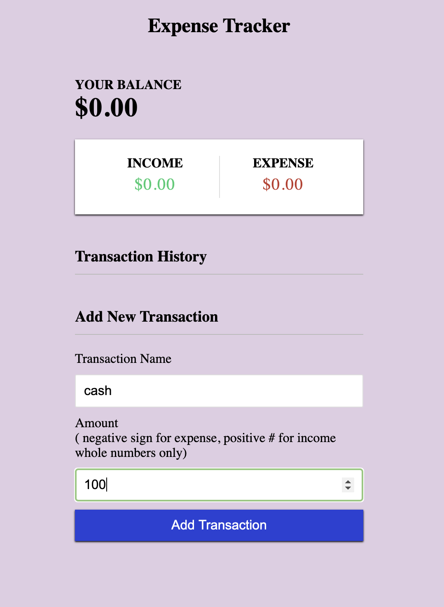
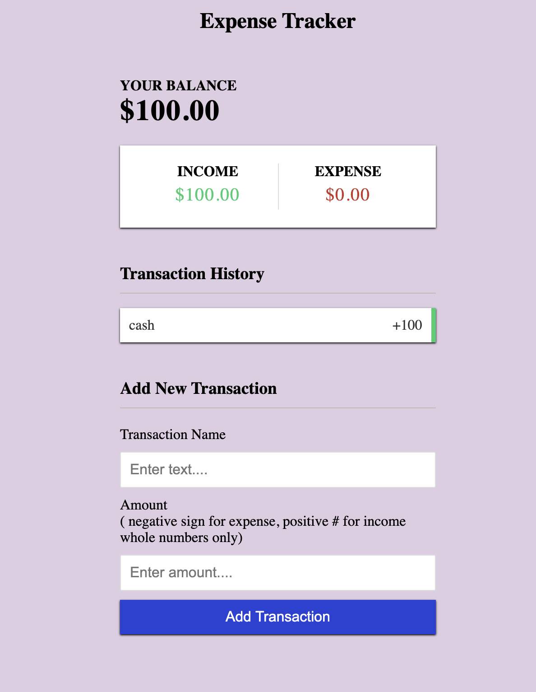
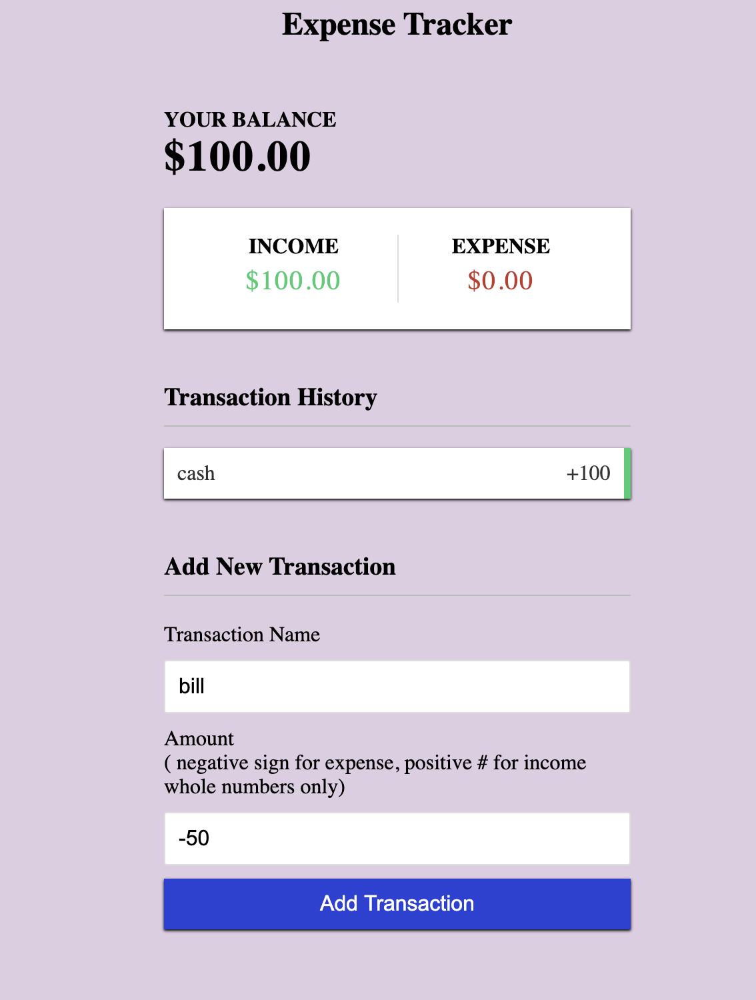
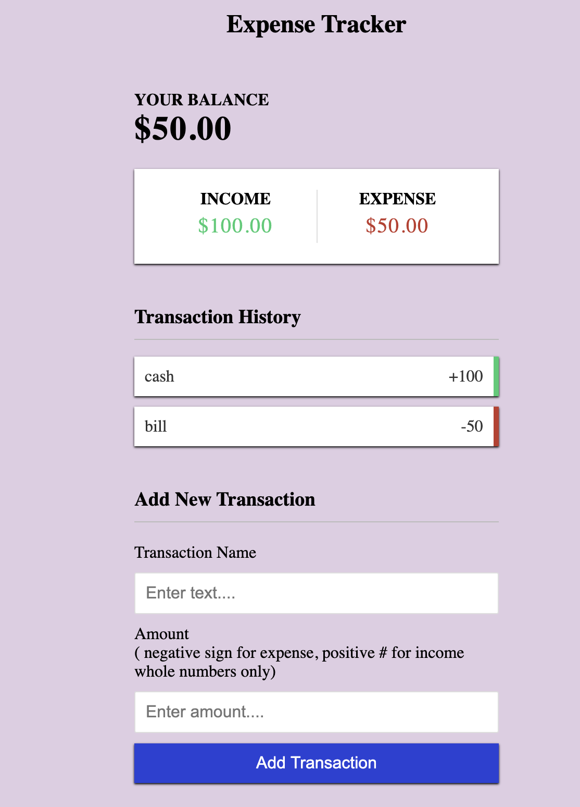
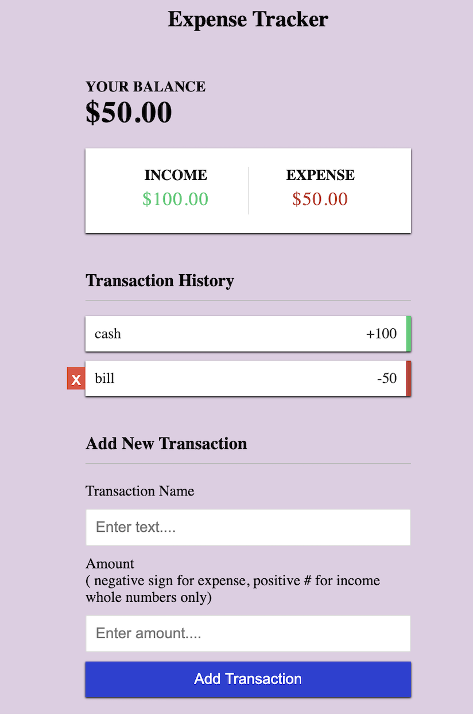

# Expense-tracking-app
## Application Overview
Desktop/mobile friendly expense tracking application. [Live Demo](https://halo8424.github.io/Expense-tracking-app/)

### How it works

_Application on first render

_Add a name for the transaction & enter a positive whole number for income

_the above example added $100 worth of income. 

_Add a name for the transaction & enter a negative whole number for expense

_Expense-tracking will update your current balance and track expenses.

_Deleting a transaction is easy, just hover over left of transaction name and delete. 

## Technologies Used
- HTML
- CSS
- JavaScript